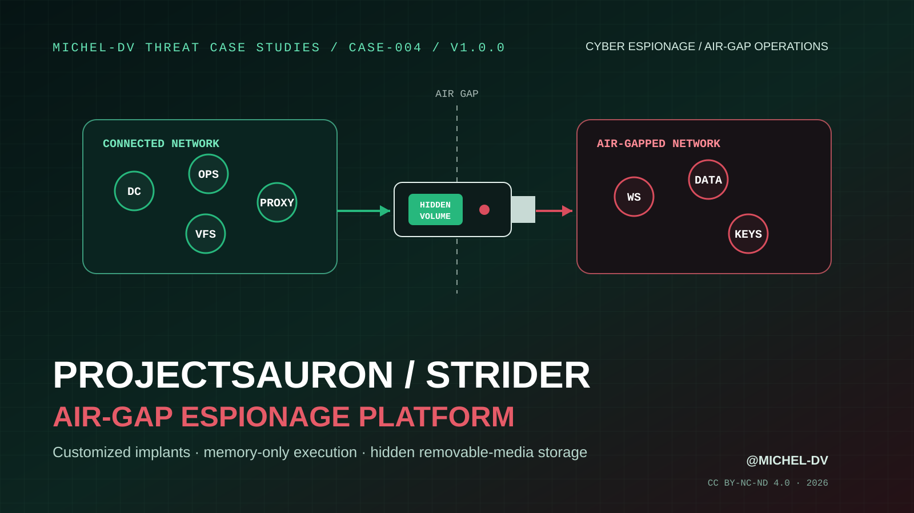

<div align="center">
  

# ProjectSauron / Strider

### Technical Case Study — Air-Gap Espionage, Memory-Only Modules and Target-Specific Tradecraft

**No reusable indicators. No visible partition. No obvious path out.**

[](#)
[](https://github.com/Michel-DV/projectsauron-air-gap-espionage-case-study/releases/tag/v1.0.0)
[](report/ProjectSauron_Air_Gap_Espionage_Case_Study_Michel-DV.pdf)
[](LICENSE)
[](https://github.com/Michel-DV)

</div>

---

## Overview

**CASE-004** reconstructs the espionage platform publicly described as **ProjectSauron**, **Strider**, and **Remsec**.

The operation is notable because it was not built around a single reusable implant or one stable command-and-control pattern. Public analysis described a modular Windows espionage framework whose artifacts, timestamps, infrastructure, encryption material and deployment details could be customized for individual targets. The platform used domain-controller password-filter persistence, a modified Lua runtime, encrypted virtual filesystems, memory-only modules, multiple network protocols and specially prepared USB media to transfer data across air-gapped environments.

The report therefore treats ProjectSauron as an **operational architecture**: a set of capabilities designed to survive inside high-value networks while deliberately reducing the value of conventional indicators of compromise.

> **Core lesson:** when an adversary removes reusable indicators, defenders must hunt the invariant behaviors - trust transitions, memory-resident execution, authentication-process modification, unusual removable-media geometry and anomalous cross-layer data flows.

## Read the report

**[Open the report in the repository →](report/ProjectSauron_Air_Gap_Espionage_Case_Study_Michel-DV.pdf)**  
**[Download the v1.0.0 release asset →](https://github.com/Michel-DV/projectsauron-air-gap-espionage-case-study/releases/download/v1.0.0/ProjectSauron_Air_Gap_Espionage_Case_Study_Michel-DV.pdf)**

Integrity check: [`report/SHA256SUMS.txt`](report/SHA256SUMS.txt)

## Operation at a glance

```text
Initial access: publicly unresolved
        ↓
High-value Windows environment
        ↓
Domain controllers / strategic servers
        ↓
LSA password-filter persistence + credential capture
        ↓
Lua-driven encrypted VFS + modular plugins
        ↓
Memory-only execution / dormant listeners
        ↓
Internal proxy nodes + multi-protocol C2
        ↓
DNS / SMTP / HTTP / custom exfiltration paths
        ↓
Specially prepared USB media
        ↓
Hidden shadow filesystem across air-gapped networks
```

## Key findings

| Finding | Why it matters |
|---|---|
| **The initial infection vector remains unknown** | Public reconstruction must begin after access rather than inventing an entry technique. |
| **Domain controllers became collection points** | A Windows password-filter mechanism exposed plaintext credentials during authentication and password changes. |
| **The platform behaved like an operating environment** | Modified Lua, encrypted VFS containers and dozens of plugins supported task-specific execution rather than a monolithic implant. |
| **Many capabilities could remain memory-resident** | Disk-centric detection had limited visibility into downloaded modules and transient execution. |
| **Air-gap transfer used hidden removable-media storage** | The actor exploited partition geometry and a custom shadow filesystem instead of relying only on visible files. |
| **Infrastructure and artifacts were target-specific** | Traditional IOC sharing lost value because indicators were deliberately not reused. |
| **DNS was both transport and telemetry** | Low-bandwidth metadata exfiltration and operation-progress signaling blended into a ubiquitous protocol. |

## What the report covers

1. Incident profile and confidence model
2. 2011-2016 public timeline
3. Victim telemetry and intelligence objectives
4. Platform architecture and terminology
5. Domain-controller LSA password-filter persistence
6. Modified Lua runtime and encrypted virtual filesystem
7. Modular plugins and memory-only execution
8. Internal deployment through legitimate software-update scripts
9. Dormant listeners, wake-up commands and internal proxy nodes
10. Multi-protocol communications and low-bandwidth DNS exfiltration
11. Air-gap bridge architecture
12. Hidden USB shadow filesystem and `MyTrampoline` data flow
13. Encryption-key and removable-media collection
14. Per-target customization, infrastructure isolation and anti-forensics
15. Why conventional IOCs lose value
16. Representative MITRE ATT&CK mapping
17. **Original trust-boundary reconstruction**
18. **Detection hypotheses and defensive control blueprint**
19. **Safe Red Team / research emulation notes**
20. Lessons, myths and primary evidence trail

## Original analysis layer

### Trust-boundary reconstruction

The report follows a sequence of trust conversions:

`Windows authentication → domain control → internal deployment → memory execution → network transit → removable media → air-gapped data → exfiltration`

At each boundary it identifies the actor's leverage, the observable invariant and a defensive choke point.

### Detection hypotheses

The analysis turns the incident into testable defensive questions around:

- unauthorized password-filter or Security Support Provider registration
- unusual modules loaded into LSASS / authentication-sensitive processes
- memory-only executable activity with weak or absent file provenance
- administrator deployment scripts diverging from approved baselines
- unusual DNS subdomain entropy and low-volume recurring beacon patterns
- systems acting as unexplained internal relay nodes
- removable media whose physical layout exceeds the visible filesystem partition
- hidden storage appearing immediately after the recognized partition boundary
- timestamp cloning and environment-specific masquerading

### Red Team / research notes

The emulation section focuses on **safe observability tests**: benign authentication-process canaries, harmless memory-only modules, mock hidden-storage layouts, synthetic DNS telemetry, internal relay simulations and controlled deployment-script tampering. It explicitly avoids credential theft, covert real-world exfiltration or operational malware.

## Important distinctions

- **No confirmed ProjectSauron zero-day was identified in the public Kaspersky analysis.**
- **Hidden USB storage is not itself an infection mechanism.** It explains covert transfer after access exists.
- **The initial infection vector remains unknown.**
- **Victim counts from Kaspersky and Symantec are different datasets, not numbers to be added together.**
- **ProjectSauron / Strider / Remsec are source-dependent labels.** This report keeps actor and malware naming disciplined.
- **Some affected organizations could be considered critical infrastructure, but public reporting did not establish a ProjectSauron SCADA-focused capability.**

## Reproducible publication

The PDF is generated from version-controlled HTML/CSS and a version-controlled vector enhancement layer by `.github/workflows/publish-report.yml`.

The workflow renders the dedicated cover and body, merges the 17-page base publication, applies the CASE-004 technical diagrams from `scripts/enhance_visuals.py`, writes explicit PDF metadata naming **Michel-DV (@Michel-DV)** as author, calculates SHA-256, commits the generated publication using the `Michel-DV` author identity, and publishes the release asset.

## Methodology

Primary technical research is prioritized, vendor-specific victim telemetry is kept separate, unknowns remain explicit, and the original analysis layer is clearly distinguished from source-reported facts.

See [`docs/METHODOLOGY.md`](docs/METHODOLOGY.md) and [`docs/REFERENCES.md`](docs/REFERENCES.md).

## Repository structure

```text
.
├── .github/workflows/
│   └── publish-report.yml
├── assets/
│   └── cover-mobile-safe.svg
├── docs/
│   ├── METHODOLOGY.md
│   └── REFERENCES.md
├── report/
│   ├── cover.html
│   ├── source.html
│   ├── ProjectSauron_Air_Gap_Espionage_Case_Study_Michel-DV.pdf
│   └── SHA256SUMS.txt
├── CHANGELOG.md
├── CITATION.cff
├── DISCLAIMER.md
├── RELEASE_NOTES.md
├── LICENSE
└── README.md
```

## Threat Case Studies series

- **CASE-001 — SolarWinds Supply-Chain Compromise**
- **CASE-002 — XZ Utils Backdoor (CVE-2024-3094)**
- **CASE-003 — 3CX DesktopApp Supply-Chain Compromise**
- **CASE-004 — ProjectSauron / Strider: Air-Gap Espionage Platform** ← this publication

## Citation

If this case study is useful in research, training, coursework or internal documentation, cite the repository or use [`CITATION.cff`](CITATION.cff).

**Author:** [@Michel-DV](https://github.com/Michel-DV)  
**Series:** Michel-DV Threat Case Studies — CASE-004  
**Release:** v1.0.0  
**Year:** 2026

## License

© 2026 **Michel-DV**.

This publication is licensed under **Creative Commons Attribution-NonCommercial-NoDerivatives 4.0 International (CC BY-NC-ND 4.0)**.

## Disclaimer

This is an independent technical study based on publicly available information. It is not affiliated with or endorsed by Kaspersky, Broadcom / Symantec, MITRE, or other referenced organizations.

---

<div align="center">

**ProjectSauron was difficult to hunt because it treated repeatable patterns as liabilities.**

[@Michel-DV](https://github.com/Michel-DV)

</div>